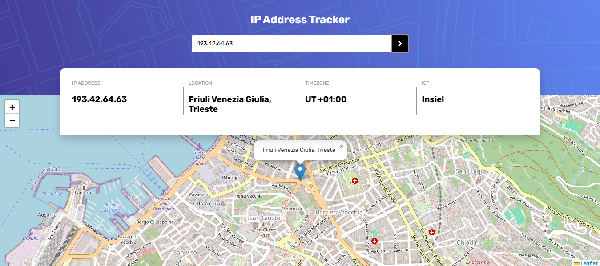

# Frontend Mentor - IP address tracker solution

This is a solution to the [IP address tracker challenge on Frontend Mentor](https://www.frontendmentor.io/challenges/ip-address-tracker-I8-0yYAH0). Frontend Mentor challenges help you improve your coding skills by building realistic projects. 

## Table of contents

- [Overview](#overview)
  - [The challenge](#the-challenge)
  - [Screenshot](#screenshot)
  - [Links](#links)
- [My process](#my-process)
  - [Built with](#built-with)
  - [What I learned](#what-i-learned)
  - [Continued development](#continued-development)
  - [Useful resources](#useful-resources)
- [Author](#author)
- [Acknowledgments](#acknowledgments)


## Overview

### The challenge

Users should be able to:

- View the optimal layout for each page depending on their device's screen size
- See hover states for all interactive elements on the page
- See their own IP address on the map on the initial page load
- Search for any IP addresses or domains and see the key information and location

### Screenshot





### Links

- Solution URL: [Add solution URL here](https://your-solution-url.com)
- Live Site URL: [Add live site URL here](https://your-live-site-url.com)

## My process

### Built with

- Semantic HTML5 markup
- CSS custom properties
- Flexbox
- [LeafletJS](https://leafletjs.com/)
- [IP Geolocation API by IPify](https://geo.ipify.org/)
- Fetch API - FOR API requests


### What I learned

Through this project, I learned how to integrate the GeoIP API to fetch details about an IP address, such as location, timezone, and ISP. I also learned how to use Leaflet.js to create a map and display the location based on latitude and longitude. One of the key aspects I improved on was managing API responses and rendering the data dynamically into the DOM.

```js
fetch(`https://geo.ipify.org/api/v2/country,city?apiKey=your_api_key&ipAddress=${ip}`)
  .then(response => response.json())
  .then(data => {
    renderData(data);
  })
  .catch(error => {
    console.error('Error fetching data:', error);
  });


```


### Continued development
In futures updates, i plan to: 
- Automatically display the user's current location upon page load.
- Add more detailed information about the IP address, such as a country flag.
- Improve the map's zoom functionality for better user experience.


### Useful resources

- [Geo API Documentation](https://www.ipify.org/) - Essential for fetching IP address data.
- [Leaflet.js Documentation](https://leafletjs.com/reference.html) - Useful for handling maps and markers.
- [MDN Fetch API](https://developer.mozilla.org/en-US/docs/Web/API/Fetch_API) - Helpful for understanding how to fetch and process API data.

## Author

- Website - [wazirwazir](https://www.your-site.com)
- Frontend Mentor - [@wazirwazir](https://www.frontendmentor.io/profile/wazirwazir)
- Twitter - [@yourusername](https://www.twitter.com/yourusername)


## Acknowledgments

A big thank you to Frontend Mentor for providing the challenge and to the developers behind the [GeoIP API](https://geo.ipify.org/) and [Leaflet.js](https://leafletjs.com/) for their excellent tools.

